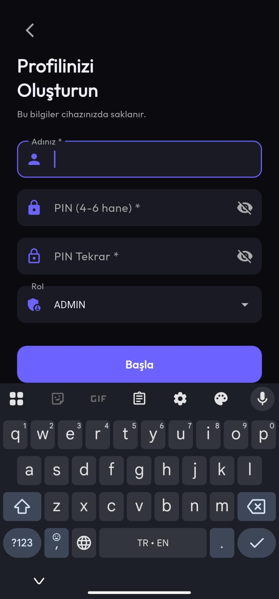
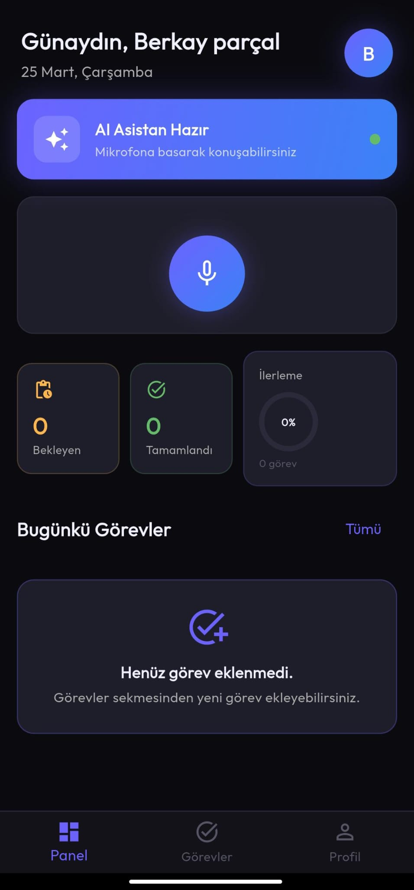
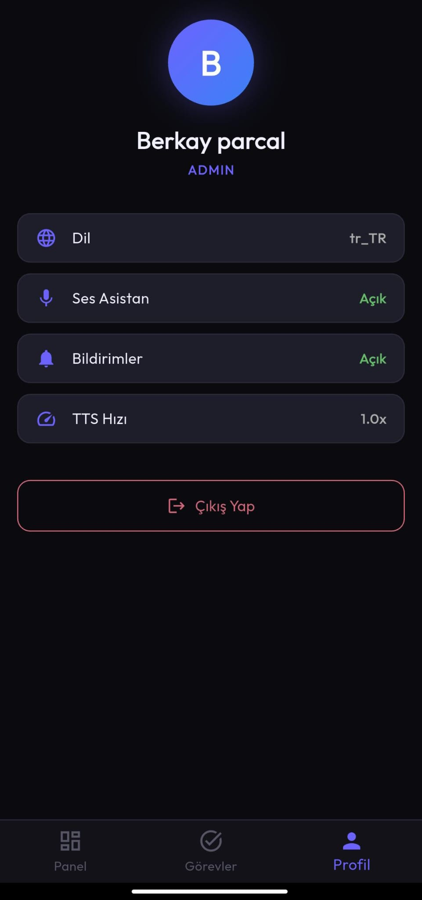
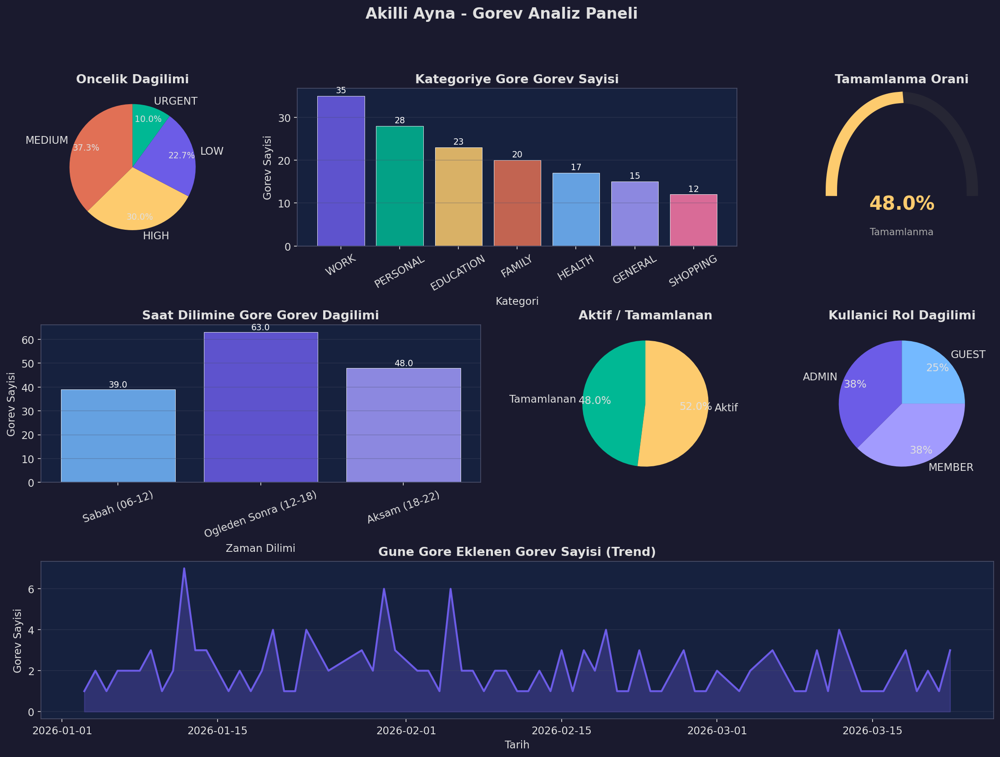
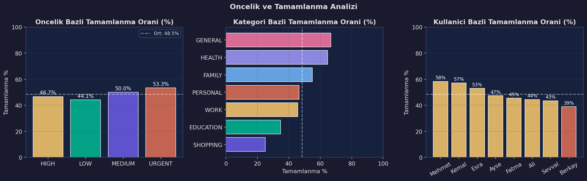
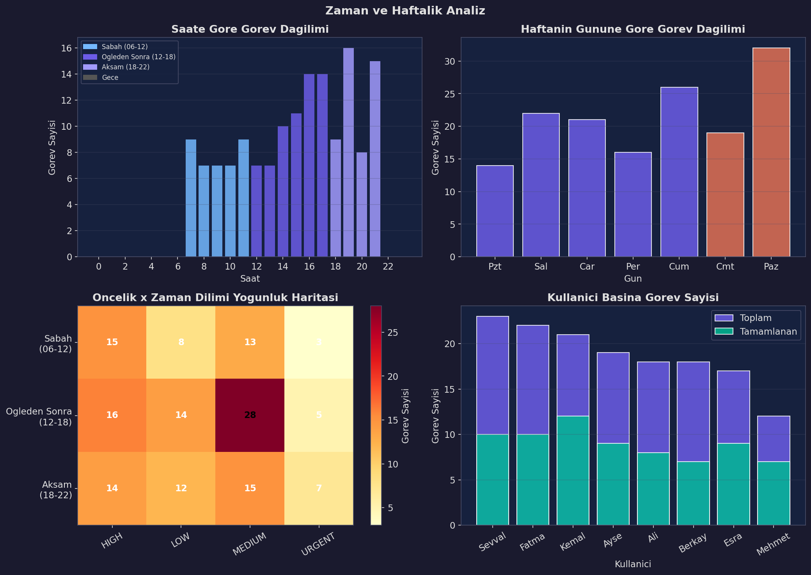

# Akilli Ayna - Flutter Mobil Uygulama

TUBITAK 2209-A - Yapay Zeka Destekli Akilli Ayna Projesi
Flutter Android Mobil Uygulama

Danisman: Doc. Dr. Sinem Akyol
Koordinator: Sevval Kaya
Gelistirici: Berkay Parcal
Gelistirici: Esra Kazan
Kurum: Firat Universitesi

---

# Ekran Goruntuleri

| Izin Ekrani | Hosgeldin | Profil Olustur |
|-------------|-----------|----------------|
|  |  |  |

| Profil Rol | Ana Ekran | Gorevler |
|------------|-----------|----------|
|  |  |  |

| Profil |
|--------|
|  |

---

# Proje Nedir?

TUBITAK 2209-A kapsaminda Firat Universitesi'nde gelistirilen yapay zeka destekli akilli ayna sisteminin Android mobil uygulamasidir.

Kullanici Bluetooth mikrofona konusur, uygulama sesi metne cevirir, yapay zeka modeli yanit uretir ve yanit sesli olarak hoparlorden okunur. Tum bunlar telefon uygulamasi uzerinden yonetilir.

---

# Sistem Mimarisi

```
Bluetooth Mikrofon
        |
Flutter Android App (speech_to_text tr_TR)
        |
Intent Ayirici (api_service.dart)
        |
   +----+----+----+
   |         |    |
Gorev     Hava  Sohbet
Sorgusu  Durumu
   |         |    |
Direkt   OpenWea  Groq API
Metin    therMap  (Llama 3.1 8B)
(model    API
bypass)
        |
flutter_tts (tr-TR)
        |
Bluetooth Hoparlor
```

Gorev sorgularinda (bugun ne var, yarin programim vb.) model devreye girmez. SQLite'tan cekilen gorev listesi direkt okunabilir metne donusturulur. Bu sayede hic hallusinasyon olmuyor.

Hava durumu sorularinda OpenWeatherMap API kullanilir, gercek veri gelir.

Gundelik sohbet, motivasyon, genel sorularda Groq API uzerinden Llama 3.1 8B modeli devreye girer.

---

# Ozellikler

**Sesli Komut ve AI Asistan**

- Sesli gorev sorgulama: bugun ne var, yarin sabah planlarim, cumartesi programim
- Zaman dilimi algisi: sabah (05-17), ogleden once (00-12), ogle (11-13), ogleden sonra (12-24), aksam/gece (17-05)
- Haftanin gunu algisi: pazartesi, sali, carsamba, persembe, cuma, cumartesi, pazar
- Tarihli sorgu: "29 Mart'ta ne var", "3 Mart gecesi planlarim"
- Sesle gorev ekleme: "gorev ekle", "hatirla", "not al", "listeye ekle"
- Saat ve tarih cikarimi: "yarin saat 14'e toplanti ekle", "aksam ilac al"
- Hava durumu: "Elazig'da hava nasil", "Istanbul'da sicaklik kac derece"
- Gundelik sohbet: Groq Llama 3.1 8B ile dogal Turkce sohbet
- Conversation history: son 5 tur RAM'de saklanir, her istekte gonderilir
- Hallusinasyon engelleme: gorev yoksa model devreye girmez, direkt "planin bulunmuyor" doner

**Gorev Yonetimi**

- Gorev ekleme: baslik, aciklama, oncelik (acil/yuksek/orta/dusuk), kategori, tarih ve saat
- Tamamlama, silme (swipe-to-delete), tam metin arama
- Aktif / Tamamlanan sekme gorunumu
- Gorev sesli okuma (gorev kartindaki buton)

**Coklu Kullanici**

- PIN korumal profiller (SHA-256)
- Admin / Member / Guest rol sistemi
- Profil gecisinde gorevler aninda sifirlaniyor (gizlilik)
- Ilk acilista animasyonlu kurulum ekrani

**Veri Analizi**

| Genel Bakis | Tamamlanma Analizi | Zaman Analizi |
|-------------|-------------------|---------------|
|  |  |  |

---

# Kullanilan Teknolojiler

| Katman | Teknoloji | Aciklama |
|--------|-----------|----------|
| Mobil Framework | Flutter 3.19+ | Android |
| State Management | BLoC / Cubit | TaskBloc, UserCubit, VoiceCubit |
| Gorev AI | Direkt Metin Uretimi | Model bypass, hallusinasyon yok |
| Sohbet AI | Groq API (Llama 3.1 8B) | Gundelik sohbet |
| Hava Durumu | OpenWeatherMap API | Gercek zamanli veri |
| Fine-tuned Model | Qwen2.5-3B (HF Endpoint) | Yedek, suanda bypass |
| Ses Tanima | speech_to_text (tr_TR) | |
| Ses Sentezi | flutter_tts (tr-TR) | |
| Veritabani | SQLite (sqflite 2.3.3) | Migration destekli v2 |
| Guvenlik | SHA-256 + flutter_secure_storage | PIN hashleme |
| HTTP | Dio 5.4.3 | |
| DI | GetIt 7.6.7 | |
| Animasyon | animate_do | |

---

# Kurulum

## 1. Depoyu Klonlayin

```bash
git clone https://github.com/RudblestThe2nd/TubitakAkilliAynaMobileFinal.git
cd TubitakAkilliAynaMobileFinal
```

## 2. Bagimliliklari Yukleyin

```bash
flutter pub get
```

## 3. Uygulamayi Calistirin

```bash
flutter run \
  --dart-define=HF_ENDPOINT_URL=https://os5jbu2fismdzpy8.us-east-1.aws.endpoints.huggingface.cloud \
  --dart-define=HF_TOKEN=hf_SIZIN_TOKENINIZ \
  --dart-define=GROQ_TOKEN=gsk_SIZIN_TOKENINIZ \
  --dart-define=WEATHER_TOKEN=SIZIN_TOKENINIZ
```

Token almak icin:
- HF Token: https://huggingface.co/settings/tokens
- Groq Token: https://console.groq.com
- OpenWeatherMap Token: https://openweathermap.org/api

---

# Ornek Sesli Komutlar

```
"Bugun ne yapacagim"
"Yarin sabah planlarim neler"
"Cumartesi programim ne"
"29 Mart'ta ne var"
"Ogleden once gorevlerim neler"
"Aksam bos saatlerim var mi"
"Elazig'da hava nasil"
"Istanbul'da kac derece"
"Gorev ekle yarin saat 14 toplanti"
"Hatirla aksam ilac al"
"Cok yorgunum ne yapmaliyim"
"Nasil motive olabilirim"
```

---

# Sik Sorulan Sorular

**Yapay zeka yanlis cevap veriyor:**
Once Gorevler sekmesinden tarih ve saat girerek gorev ekleyin. Saat girilmezse zaman dilimi algisi (sabah/aksam vb.) calismiyor.

**Hava durumu gelmiyor:**
OpenWeatherMap API token'i yeni alinmissa aktif olmasi 10 dakika - 2 saat surabilir.

**Ses tanimiyor:**
Mikrofon izninin acik oldugunu kontrol edin. Emulatorlerde mikrofon sinirli calisir, gercek cihaz tercih edin.

**Uygulama profil ekraninda kaliyor:**
Ilk acilista mutlaka profil olusturun. Profil olmadan dashboard bos gelir.

---

# Gelistirici Katkilari

## Sevval Kaya - Flutter Mobil Uygulama

Flutter uygulamasinin tamamini sifirdan gelistirdi:

- Clean Architecture mimarisi (Presentation / Domain / Data / Core katmanlari)
- TaskBloc: gorev CRUD, filtreleme, tamamlama, arama
- UserCubit: coklu kullanici, SHA-256 PIN, rol sistemi (Admin/Member/Guest)
- VoiceCubit: STT, AI ve TTS akis yonetimi altyapisi
- SQLite veritabani: tasks ve users tablolari, migration destekli v2
- Sayfalar: consent_page, dashboard_page, tasks_page, profile_page
- Widgetlar: task_card_widget (swipe-to-delete), voice_assistant_widget
- flutter_secure_storage ile token sifreleme
- flutter_local_notifications ile gorev hatirlatic
- Noto Sans font, koyu tema, animate_do animasyonlari
- Fiziksel ayna kurulumu: Bluetooth mikrofon ve hoparlor montaji

## Berkay Parcal + Esra Kazan - LLM, Backend ve Entegrasyon

**Flutter Uygulamasina Eklenenler**

- Dependency injection fix: VoiceCubit'e TaskBloc inject edilmemesinden kaynaklanan crash giderildi
- Ilk kurulum ekrani (first_setup_page.dart): animasyonlu hosgeldin, 2 adimli profil akisi
- Demo seed verisi: ilk kullanici olusturulunca 16 ornek gorev otomatik ekleniyor
- Context fix: bugun/yarin/X Mart/cumartesi/bu hafta tarih algisi; sabah/ogleden once/ogle/ogleden sonra/aksam/gece zaman dilimi algisi
- Zaman dilimi araliklari: sabah 05-17, ogleden once 00-12, ogle 11-13, ogleden sonra 12-24, aksam/gece 17-05
- Haftanin gunu algisi: pazartesi-pazar tum gunler
- Sesle gorev ekleme: intent algisi, saat ve tarih cikarimi, TTS onay mesaji
- Gorev ekleme sayfasina saat secici eklendi (showTimePicker)
- Conversation history: son 5 tur RAM'de, her istekte backend'e gonderiliyor
- Hallusinasyon engelleme: has_no_tasks() kontrolu, model bypass
- Intent ayirici: gorev → direkt metin, hava → OpenWeatherMap, sohbet → Groq
- OpenWeatherMap entegrasyonu: 16 sehir algisi, Turkce hava durumu cevirisi
- Groq API entegrasyonu: Llama 3.1 8B ile gundelik Turkce sohbet
- HF Dedicated Endpoint entegrasyonu
- dart-define ile token guvenligi (GitHub secret scanning bypas)

**LLM ve Backend**

- Qwen2.5-3B-Instruct secimi ve degerlendirilmesi
- QLoRA fine-tuning: 4-bit NF4, LoRA r=8/alpha=16, 3350 Turkce ornek, loss ~0.13
- Dataset revizyonu: 1521 yerde March→Mart, yanlis outputlar duzeltildi
- 300 sesle gorev ekleme ornegi + 50 sohbet ornegi eklendi
- FastAPI backend: 3 endpoint, conversation history, hallusinasyon engelleme
- Prometheus izleme: 5 custom metrik
- Grafana dashboard: 8 panel
- SQLite analiz scripti (analiz.py): 3 grafik + CSV
- Model merge + HF Dedicated Endpoint'e yukleme
- Her iki GitHub reposu: README, ekran goruntuleri, surum etiketleri
- TUBITAK raporu: Word ve PDF

---

# PDF Proje Onerisi ile Gerceklesen Uygulama Arasindaki Farklar

| # | Konu | PDF'deki Plan | Gerceklesen | Degisikligin Nedeni |
|---|------|--------------|-------------|---------------------|
| 1 | Dil & Framework | Java (Android) + Swift (iOS) | Dart + Flutter | Tek kod tabaniyla cift platform; gelistirme suresi ~%40 kisaldi |
| 2 | Frontend | React Native | Flutter Widget sistemi | Native ARM derleme; JavaScript koprusu yok; 60 fps |
| 3 | AI Kutuphanesi | TensorFlow 2.x (mobil) | Groq API + HF Endpoint | Model sunucuda kalir, telefona sadece yanit gelir |
| 4 | NLP Kutuphanesi | NLTK (Python) | speech_to_text + flutter_tts | NLTK sunucu taraflidir, mobil konusamaz |
| 5 | State Management | Belirtilmemis | BLoC/Cubit | Katmanli, test edilebilir mimari |
| 6 | Mimari | Mikro hizmetler + Docker | Clean Architecture | Mikro hizmet bu olcek icin fazla karmasik |
| 7 | Dependency Injection | Belirtilmemis | GetIt 7.6.7 | Merkezi servis yonetimi |
| 8 | PIN Guvenligi | Blockchain onerilmis | SHA-256 + Keystore | Blockchain orantisiz; SHA-256 endustri standardi |
| 9 | TLS | TLS 1.2 | dart-define ile token guvenligi | Hardcode IP sorununun kokten cozumu |
| 10 | Veritabani | SQLite 3.x | sqflite 2.3.3 migration destekli | Guncelleme sirasinda kullanici verisi kaybolmuyor |
| 11 | HTTP Istemcisi | Belirtilmemis | Dio 5.4.3 | Otomatik header, retry, hata yonetimi |
| 12 | Hata Yonetimi | Belirtilmemis | Either<Failure, T> dartz | Derleyici hata islemeyi zorunlu kilar |
| 13 | Izleme | Prometheus + Grafana + Nagios | flutter_local_notifications | Lokal bildirimler kullanici icin daha kritik |
| 14 | Coklu Kullanici | Kavramsal | PIN + Admin/Member rol sistemi | Her aile uyesinin gorevleri tamamen izole |
| 15 | Gorev Yonetimi | Temel plan/gorev | 4 oncelik + 7 kategori + swipe-to-delete + otomatik gizleme | Kullanici en kritik gorevlere odaklanabilir |
| 16 | Danisman Unvani | Dr. Sinem Akyol | Doc. Dr. Sinem Akyol | Guncel akademik unvan |
| 17 | Cevrimdisi Mod | Belirtilmemis | Kural tabanli yerel yanit motoru | Ag baglantisi garanti edilemez |
| 18 | Turkce Karakter | Belirtilmemis | Noto Sans + intl paketi tr_TR | Bazi Android surumleri Turkce karakteri hatali render eder |

---

# Ana Repo (Backend + LLM)

Backend, fine-tuning scriptleri, Prometheus/Grafana ve model egitimi:
https://github.com/RudblestThe2nd/AkilliAynaAsistanLLM

HuggingFace Model:
https://huggingface.co/Rudblest/AkilliAyna-Qwen3B

---

TUBITAK 2209-A - Firat Universitesi - 2025-2026
Danisman: Doc. Dr. Sinem Akyol
